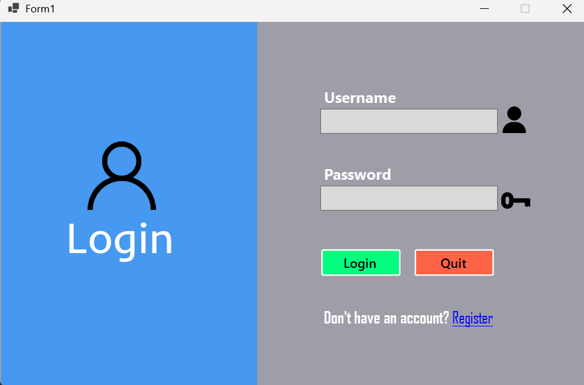
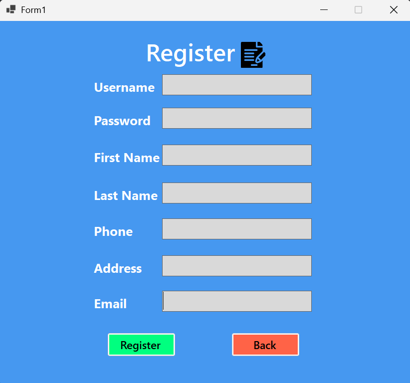
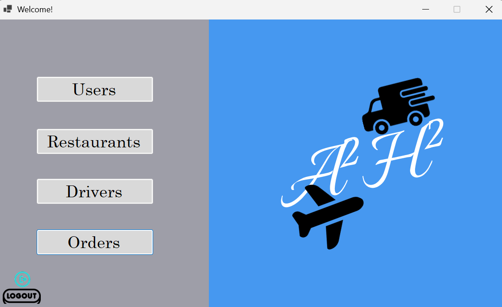
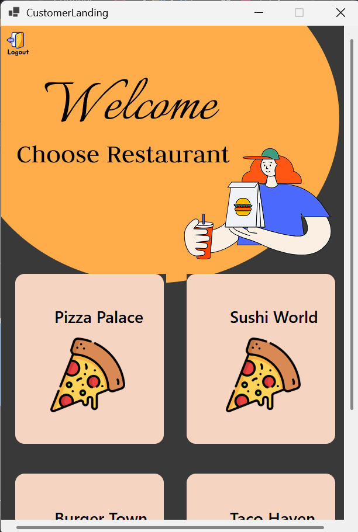

# 🍽️ Delivery Management System – WinForms + SQL Server

This is a desktop-based Delivery Management System built using C# (WinForms) and SQL Server. It provides interfaces for Admin users to manage the system and for Customers to browse restaurants and place orders.

## ✅ Features

### 👤 Admin Panel

Admins can log in and perform full CRUD operations on:

✅ Users – manage customer/admin accounts

✅ Restaurants – add/edit/remove restaurants and their details

✅ Drivers – manage delivery drivers

✅ Orders – view and delete orders

Includes built-in validation and database error handling.

### 🛒 Customer Interface

Customers can:

👀 View available restaurants

🍽️ See menus for each restaurant

📦 Place orders with a clean, minimal UI

## 🧰 Technologies Used

C# with Windows Forms (WinForms)

Microsoft SQL Server

.NET Framework

Microsoft.Data.SqlClient for DB connection

## 🚀 Getting Started

1. Clone the Repository

```bash
git clone https://github.com/Ize-Aman/FoodDelivery.git
```

2. Set Up the Database

- Open SQL Server Management Studio (SSMS)
- open the file DMS#3. it is included in the project
- Run the CreateTables queries
- Make sure your connection string matches your local database setup:

```csharp
string conString = "Data Source=YOUR_SERVER;Initial Catalog=CSDB;Integrated Security=True;";
```

3. Run the Application

- Open the solution (.sln) in Visual Studio
- Press F5 to build and run

## 🗃️ Database Schema (Simplified)

Users

```sql
UserID INT PRIMARY KEY,
UserName VARCHAR(30) UNIQUE,
Password VARCHAR(10),
UserType CHAR(1) CHECK (UserType IN ('A', 'C')),
```

Restaurant

```sql
RestaurantID INT PRIMARY KEY,
Name VARCHAR(100),
Location TEXT,
Phone VARCHAR(10),
```

Order

```sql
OrderID INT PRIMARY KEY,
CustomerID INT,
RestaurantID INT,
TotalCost DECIMAL(6,2),
```

Driver

```sql
DriverID INT PRIMARY KEY,
Name VARCHAR(100),
Phone VARCHAR(10),
```

## 📸 Screenshots (Optional)

If you want to add screenshots:





## 👨‍💻 Author

Built with passion by Ammanuel

Powered by teamwork, code, and coffee ☕
